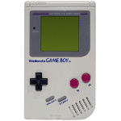

# Game Boy

  
|Component|Description                                            |
|---------|-------------------------------------------------------|
|CPU	    |Custom 8bit Sharp LR35902 4.19MHz                      |
|RAM	    |8KB SRAM, 8KB Video, On-CPU-Die 256Bytes bootstrap ROM |
|Screen	  |2.6" 2Bit 160x144(59.727500569606Hz, VBLANK: 1.1ms)    |
|Slot	    |32 KB, 64KB, 128KB, 256KB, 512KB, 1MB, 2MB, 4MB and 8MB|
|Gamepad	|DPad, 2 Buttons, Start, Select                         |
|Battery	|AA x 2                                                 |
|Dimension|148mm x 90mm x 32mm                                    |
|Weight	  |220g                                                   |

### https://steward-fu.github.io/website/index.htm
